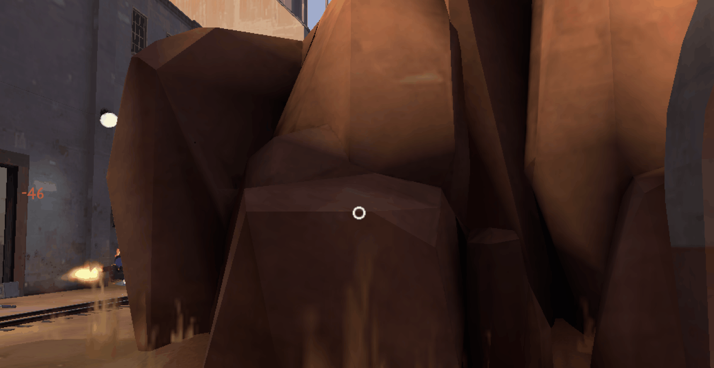
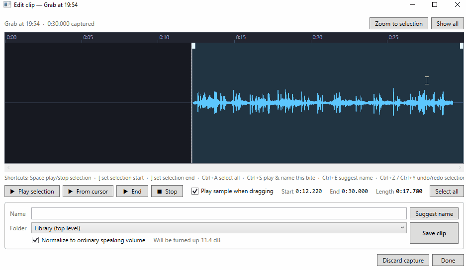
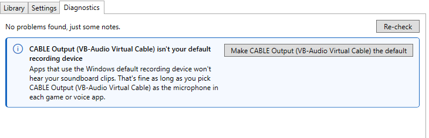

[QuickParrot](https://github.com/rspeele/QuickParrot/releases/download/v0.1/QuickParrot.App.exe) is a soundboard for
Windows gaming that lets you pull up the exact clip you want in a few keystrokes, without manually assigning a ton of
hotkeys and trying to remember them. It relies on [VB Audio virtual cable](https://vb-audio.com/Cable/) to play sounds
into your programs like a microphone. It can display an overlay, as long as your game runs in a borderless window
instead of true exclusive fullscreen.

You pick a sound, potentially from subfolders, by holding down a chord key (default `Num-`) while hitting number keys.

It can artificially hold your push-to-talk key for you while the clip is playing.

It also works as a "snipping tool" for sounds, maintaining a 30 second buffer from which you can grab the sound you just
heard.

Lastly, it can fix up your Virtual Audio Cable settings for you. These can be a little funky to set up in Windows,
especially since in the modern era our beloved ol' Control Panel has been hidden behind some half baked settings apps.

# Installing

First you have to install [VB Audio virtual cable](https://vb-audio.com/Cable/). Confirm that you now have an audio
device called "Cable Input (VB-Audio Virtual Cable). Then [get and run
QuickParrot](https://github.com/rspeele/QuickParrot/releases/download/v0.1/QuickParrot.App.exe) and go to the
diagnostics tab and it'll help you set up the rest.

If you want to understand this: the way it works is that you'll set your microphone in games, mumble, etc to "VB
Output". Yes, it's confusing that you select "output" for an "input device". But from another angle it makes sense:
QuickParrot plays its sounds into "VB Input" and they come out of "VB Output" as though it's the microphone jack.

Of course, you still want to be able to use your *actual* mic. The way that works is you enable a "Listen to This
Device" setting in control panel so the real mic gets included in VB Output. Again, QuickParrot's diagnostic screen will
help set this up for you.

I found with the old soundboard I was using, occasionally a Windows update would break the setup by either resetting my
default communication device or unchecking the "listen to this device" option in the control panel. That's why I made it
a diagnostic so I don't have to remember how to dig through the control panel for this junk.

# Using

Point it at a folder where you've got your mp3s. I suggest organizing them into subfolders.

The UI for playing a sound is based on a **chord key**. **Default is `Numpad -`**. You hold the key down and the overlay
pops up. Then you hit a number key to play a sound or navigate into a subfolder. The path to play a sound down in a
subfolder could be e.g. `- 2 1 7`.

While playing a sound if you quickly tap the chord key again it cancels playback. If you play a 2nd sound while the 1st
is still going, it will stop the first immediately before playing the 2nd.

If you want to navigate to a subfolder and stay there to play multiple sounds, hit `Numpad *` while navigating. The
next time you hit the chord key you'll start in that folder instead of starting over from the root.

## Favorites

You can assign favorite sounds to the F1-F12 keys.

To assign F2, hit `Chord+Shift+F2`. Then while still holding the chord key, navigate to the sound you want as usual. It
will not play, but instead it'll go in the F2 slot and you can play it next time with chord+F2. You can also change this
so favorites don't even require hitting the chord key to play, but that might conflict with in-game bindings.

## Search

`Chord+Numpad /` opens a search. `Esc` exits. Search always spans your whole sound library regardless of what subfolder
you're in.

When searching, if you enter "multiple words" that searches for sound filenames that contain "multiple" and contain
"words", not necessarily in that order.

## Push to Talk

On the settings tab, you can enable "hold push-to-talk while clips play". QP will send a simulated keystroke holding
down the key or mouse button you select for the duration of any clip that plays. Pre-roll and post-roll are extra
margins of push-to-talk time before and after the clip to make sure it gets through in its entirety.

Some games might not accept this fake keyboard input. 🤷‍♂️

## Grabbing Clips

`Chord+Enter` grabs a clip of the last 30 seconds. This goes in the "pending grabs" on the library tab. Double-clicking
that opens it and you can save snippets from that 30-second buffer by dragging the start and end segments, then typing a
name for the file and hitting save.

I recomment using `Ctrl+S` after you've dragged the boundaries of the clip where you want. That focuses the textbox,
replays the chosen clip so you can hear it while you type, and enter saves it.

You can hook up an AI via the LiteLLM API in the settings tab. After doing that you can suggest a name for the clip with
`Ctrl+E`. But it's kind of a waste of time when you could just type it in 2 seconds. This was less cool than I imagined.

# Anticheat

The artificial keypress for push-to-talk *might* get ignored by some games or maybe even flagged by anticheat. Look up
whether a game works with AutoHotKey. If the game doesn't like AHK, it won't like QuickParrot's artificial push to talk
keypress either.

Steam and Mumble can do overlays even on true-fullscreen games but since this requires DLL injection I decided the risk
of setting off anticheat was too high. That's why my overlay only works with windowed-mode games.

# Note

Yep, it's AI slop. This is an objectively silly toy and I would not bother making it at all, let alone to this level of
polish, if I were writing it myself. It's free, take it or leave it.

I did write this README, because I don't like reading AI text. There's another one that started as my design doc but
over time had AI edits accumulate, over at [READSLOP.md](READSLOP.md). I haven't read it, it might be good.

